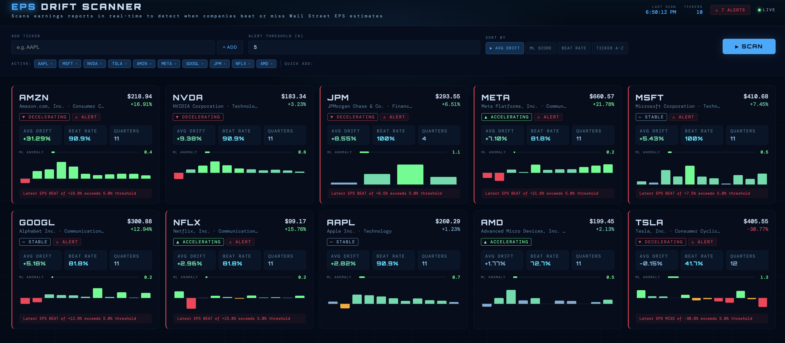

# 📈 EPS Drift Scanner

A full-stack real-time earnings analysis tool that scans stocks for EPS beats and misses against Wall Street estimates, with ML-powered anomaly detection.

🔴 **Live Demo:** [eps-drift-scanner.vercel.app](https://eps-drift-scanner.vercel.app)



## What it does

- Fetches live EPwS actuals vs analyst estimates for any stock ticker via Financial Modeling Prep API
- Calculates drift % per quarter and classifies as Strong Beat / Beat / In Line / Miss / Strong Miss
- Detects whether a company's drift trend is accelerating, decelerating, or stable
- Uses scikit-learn LinearRegression to flag anomalous EPS surprises vs a company's own historical pattern
- Fires configurable alerts when drift exceeds a threshold
- Interactive drill-down panel with full earnings history and charts per ticker

## Tech Stack

| Layer | Tech |
|---|---|
| Backend API | FastAPI |
| Data ingestion | Financial Modeling Prep API |
| Data processing | pandas |
| ML anomaly detection | scikit-learn |
| Frontend | React + Vite |
| Charts | Recharts |
| Styling | CSS Modules |

## Project Structure
```
EPS-Drift-Scanner/
├── backend/
│   ├── main.py                  # FastAPI entry point
│   └── app/
│       ├── routers/             # API route handlers
│       ├── services/            # Business logic (data fetching, drift calc, ML)
│       ├── models/              # Pydantic schemas
│       └── utils/               # Logger
└── frontend/
    └── src/
        ├── components/          # Header, ControlBar, TickerCard, DetailPanel
        ├── hooks/               # useScan custom hook
        ├── utils/               # API calls, formatters
        └── styles/              # Global CSS variables and theme
```

## Setup

### Backend
```bash
cd backend
conda activate base
pip install fastapi uvicorn requests pandas numpy scikit-learn pydantic
uvicorn main:app --reload --port 8000
```

### Frontend
```bash
cd frontend
npm install
npm run dev
```

Open **http://localhost:5173**, add tickers and hit **SCAN**.

> **Local dev note:** The frontend defaults to `http://localhost:8000/api`. The live Vercel deployment uses the `VITE_API_URL` environment variable to point to Render.