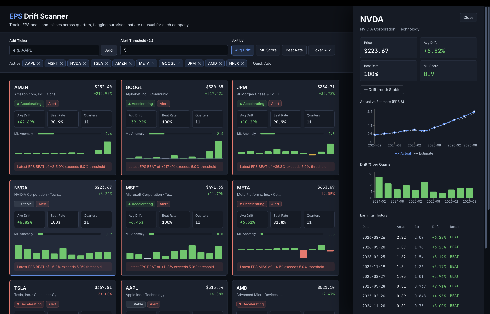

# EPS Drift Scanner

Tracks EPS beats and misses across quarters, flagging surprises that are unusual for each company rather than against a fixed threshold.

**Live demo:** [eps-drift-scanner.vercel.app](https://eps-drift-scanner.vercel.app)



## What it does

- Pulls reported EPS against consensus analyst estimates for any US-listed ticker
- Computes drift % per quarter and classifies each result as Strong Beat, Beat, In Line, Miss, or Strong Miss
- Classifies a company's drift trend as accelerating, decelerating, or stable
- Scores each latest surprise for how unusual it is against that company's own history using scikit-learn
- Fires configurable alerts when drift exceeds a user-set threshold
- Drill-down panel with full earnings history, actual vs estimate, and per-quarter drift charts

## How the drift tiers work

Drift is the percentage gap between reported EPS and the consensus estimate. The tiers are:

| Drift | Classification |
|---|---|
| ≥ +10% | Strong Beat |
| +2% to +10% | Beat |
| −2% to +2% | In Line |
| −10% to −2% | Miss |
| ≤ −10% | Strong Miss |

The ±2% band treats small gaps as noise rather than signal, since consensus estimates are rarely precise to the cent.

The ML score is separate. A 6% beat is routine for one company and abnormal for another, so the model compares each surprise against that company's own historical drift pattern instead of a fixed cutoff.

## Coverage

US-listed equities only. Canadian issuers were tested, including cross-listed names like RY and TD on the NYSE, but the data provider gates non-US earnings history behind a paid tier. Those tickers return profile data with no EPS history, so they are excluded.

## Tech stack

| Layer | Tech |
|---|---|
| Backend API | FastAPI |
| Data source | Financial Modeling Prep API |
| Data processing | pandas |
| Anomaly detection | scikit-learn |
| Frontend | React + Vite |
| Charts | Recharts |
| Styling | CSS Modules |

## Project structure

```
EPS-Drift-Scanner/
├── backend/
│   ├── main.py                  # FastAPI entry point
│   └── app/
│       ├── routers/             # API route handlers
│       ├── services/            # Data fetching, drift calculation, ML scoring
│       ├── models/              # Pydantic schemas
│       └── utils/               # Logger
└── frontend/
    └── src/
        ├── components/          # Header, ControlBar, TickerCard, DetailPanel
        ├── hooks/               # useScan
        ├── utils/               # API calls, formatters
        └── styles/              # Global tokens and theme
```

## Setup

### Backend

```bash
cd backend
python -m venv venv
source venv/bin/activate
pip install -r requirements.txt
```

Create `backend/.env` with a Financial Modeling Prep API key:

```
FMP_KEY=your_key_here
```

Then run:

```bash
uvicorn main:app --reload --port 8000
```

### Frontend

```bash
cd frontend
npm install
npm run dev
```

Open http://localhost:5173, add tickers, and hit Scan.

## Deployment

Backend on Render, frontend on Vercel. The frontend defaults to `http://localhost:8000/api` locally and reads `VITE_API_URL` in production. The backend reads `FMP_KEY` from the environment.

The live backend runs on a free Render instance, so the first scan after a period of inactivity can take 30 to 60 seconds while the service wakes up.